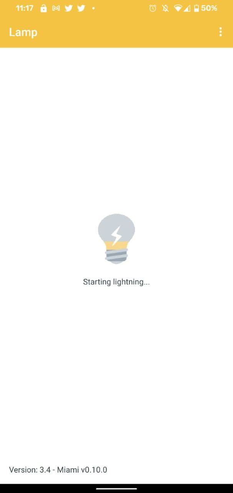
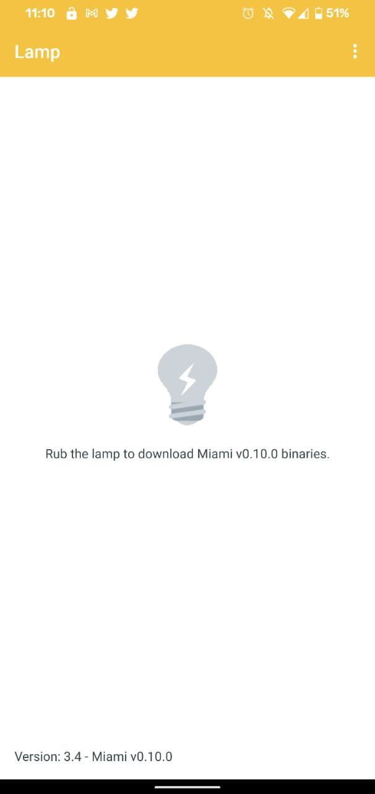

# Lamp 
<strong> [c-Lightning](https://github.com/ElementsProject/lightning) Android Mobile Porting </strong>

[](https://github.com/clightning4j/lamp/actions)
[](https://github.com/clightning4j/lamp/actions)

[](https://github.com/clightning4j/lamp/blob/master/LICENSE)


> This is an experimenting lightning wallet. Use it on testnet or only with amounts you can afford to lose on mainnet.

Touch the lamp to download and run c-lightning from cross-compiled binaries for Android are available [here](https://github.com/clightning4j/lightning_ndk/releases).






## Bitcoin Setup

#### Automatic with esplora plugin

This is the default behaviour.

Lamp is using [the C Esplora plugin for C-lightning](https://github.com/clightning4j/esplora_clnd_plugin) as the Bitcoin backend of the lightning node (to fetch chain/blocks/transactions information and send transactions).

You can point it to your own [Esplora](github.com/Blockstream/esplora) instance in the settings, and it uses [blockstream.info](https://blockstream.info) by default.


#### Manually with bitcoind rpc node
On Lamp settings, disable Esplora plugin and set the current Bitcoin RPC options:

- Bitcoin RPC username
- Bitcoin RPC password
- Bitcoin RPC host (default 127.0.0.1)
- Bitcoin RPC port (default 18332 for testnet)

## Tor Setup

#### Automatic with internal tor service

Lamp is using tor hidden service as default. A new hidden service will be created at the first running time.

#### Manually with Orbot

Open [Orbot](https://github.com/guardianproject/Orbot) and setup a fixed tor address by menu: Onion Services -> Hosted Services -> set a service name and port 9735. Restarting tor to discover and copy the local address.

On Lamp settings, enable proxy using orbot localhost gateway:

- proxy: 127.0.0.1:9050
- announce address: tor_address
- bind address: 127.0.0.1:9735

Read the following instructions at [Tor on clightning](https://lightning.readthedocs.io/TOR.html) to setup address on different network scenario.

## Building

 * [in Linux using cmdline tools](doc/cmdline-tools-setup.md)

## Code Style
[](https://ktlint.github.io/)

> We live in a world where robots can drive a car, so we shouldn't just write code, we should write elegant code.

This repository use [ktlint](https://github.com/pinterest/ktlint) to maintains the code of the repository elegant, so 
before submit the code check the Kotlin format with the following command on the root of the directory

```bash
./gradlew formatKotlin
```

## References

- [ABCore](https://github.com/greenaddress/abcore) Android Bitcoin Core wallet
- [bitcoin_ndk](https://github.com/greenaddress/bitcoin_ndk) ndk build of bitcoin core and knots
- [clightning_ndk](https://github.com/clightning4j/lightning_ndk) android cross-compilation of c-lightning for Android >= 24 Api
- [c-lightning](https://github.com/ElementsProject/lightning) Lightning Network implementation in C
- [esplora plugin](https://github.com/clightning4j/esplora_clnd_plugin) C-Lightning plugin for esplora
